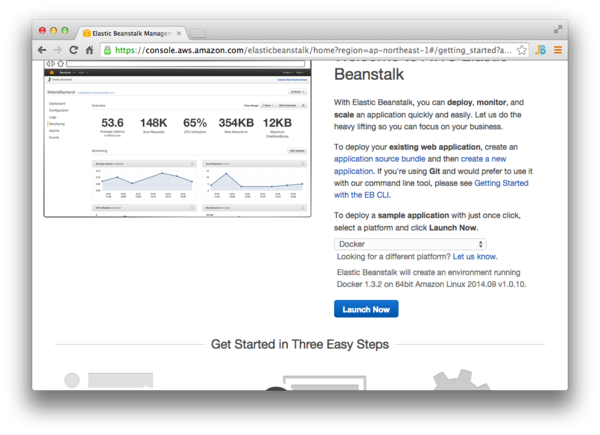
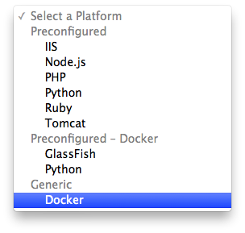
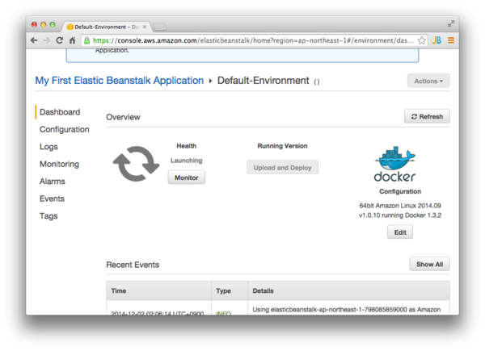
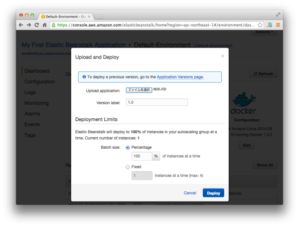
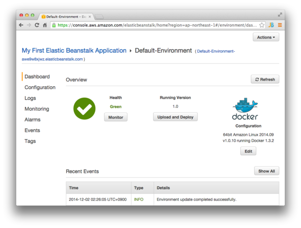
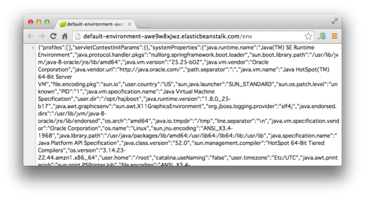

# Spring Boot Docker Blank

Maven archetype to create a docker-configured maven project for Spring Boot Application

## How to use

with Bash

    mvn archetype:generate\
     -DarchetypeGroupId=am.ik.archetype\
     -DarchetypeArtifactId=spring-boot-docker-blank-archetype\
     -DarchetypeVersion=0.9.0

with CommandPrompt (Windows)

    mvn archetype:generate^
     -DarchetypeGroupId=am.ik.archetype^
     -DarchetypeArtifactId=spring-boot-docker-blank-archetype^
     -DarchetypeVersion=0.9.0

### Example

#### Create a project

```
$ mvn archetype:generate -B\
 -DarchetypeGroupId=am.ik.archetype\
 -DarchetypeArtifactId=spring-boot-docker-blank-archetype\
 -DarchetypeVersion=0.9.0\
 -DgroupId=com.example\
 -DartifactId=hajiboot\
 -Dversion=1.0.0-SNAPSHOT
[INFO] Scanning for projects...
[INFO]
[INFO] ------------------------------------------------------------------------
[INFO] Building Maven Stub Project (No POM) 1
[INFO] ------------------------------------------------------------------------
[INFO]
[INFO] >>> maven-archetype-plugin:2.2:generate (default-cli) @ standalone-pom >>>
[INFO]
[INFO] <<< maven-archetype-plugin:2.2:generate (default-cli) @ standalone-pom <<<
[INFO]
[INFO] --- maven-archetype-plugin:2.2:generate (default-cli) @ standalone-pom ---
[INFO] Generating project in Batch mode
[WARNING] Archetype not found in any catalog. Falling back to central repository (http://repo1.maven.org/maven2).
[WARNING] Use -DarchetypeRepository=<your repository> if archetype's repository is elsewhere.
Downloading: http://repo1.maven.org/maven2/am/ik/archetype/spring-boot-docker-blank-archetype/0.9.0/spring-boot-docker-blank-archetype-0.9.0.jar
Downloaded: http://repo1.maven.org/maven2/am/ik/archetype/spring-boot-docker-blank-archetype/0.9.0/spring-boot-docker-blank-archetype-0.9.0.jar (6 KB at 7.5 KB/sec)
Downloading: http://repo1.maven.org/maven2/am/ik/archetype/spring-boot-docker-blank-archetype/0.9.0/spring-boot-docker-blank-archetype-0.9.0.pom
Downloaded: http://repo1.maven.org/maven2/am/ik/archetype/spring-boot-docker-blank-archetype/0.9.0/spring-boot-docker-blank-archetype-0.9.0.pom (3 KB at 3.8 KB/sec)
[INFO] ----------------------------------------------------------------------------
[INFO] Using following parameters for creating project from Archetype: spring-boot-docker-blank-archetype:0.9.0
[INFO] ----------------------------------------------------------------------------
[INFO] Parameter: groupId, Value: com.example
[INFO] Parameter: artifactId, Value: hajiboot
[INFO] Parameter: version, Value: 1.0.0-SNAPSHOT
[INFO] Parameter: package, Value: com.example
[INFO] Parameter: packageInPathFormat, Value: com/example
[INFO] Parameter: package, Value: com.example
[INFO] Parameter: version, Value: 1.0.0-SNAPSHOT
[INFO] Parameter: groupId, Value: com.example
[INFO] Parameter: artifactId, Value: hajiboot
[INFO] project created from Archetype in dir: /Users/maki/tmp/hajiboot
[INFO] ------------------------------------------------------------------------
[INFO] BUILD SUCCESS
[INFO] ------------------------------------------------------------------------
[INFO] Total time: 8.407s
[INFO] Finished at: Wed Oct 08 09:20:27 JST 2014
[INFO] Final Memory: 15M/109M
[INFO] ------------------------------------------------------------------------
```

#### Build the application

```
$ mvn clean package
$ cd target
$ sudo docker build -t spring-boot-docker-demo .
```

#### Deploy to Docker container

```
$ sudo docker run -p 8080:8080 -t spring-boot-docker-demo
```
Access [http://localhost:8080](http://localhost:8080)

## Deploy to AWS Elastic Beanstalk

At `target` directory after `mvn package`

```
$ zip app.zip Dockerfile Dockerrun.aws.json *.jar
```

Go to "AWS Elastic Beanstalk Management Console".



Change the platform to "Docker".



Wait a few minutes until the default environment is created.



when the "Health" gets "Green", your environment is ready.


Then, select `app.zip` you've just created and enter the application version.
Click "Deploy".



After your app is deployed, the "Health" will get "Green" again.



Access the endpoint (default-environment-XXXXXXXX.elasticbeanstalk.com), you can meet "Hello World!".


You can also know the environment info using "Spring Boot Actuator" :-)




## License

Licensed under the Apache License, Version 2.0.
